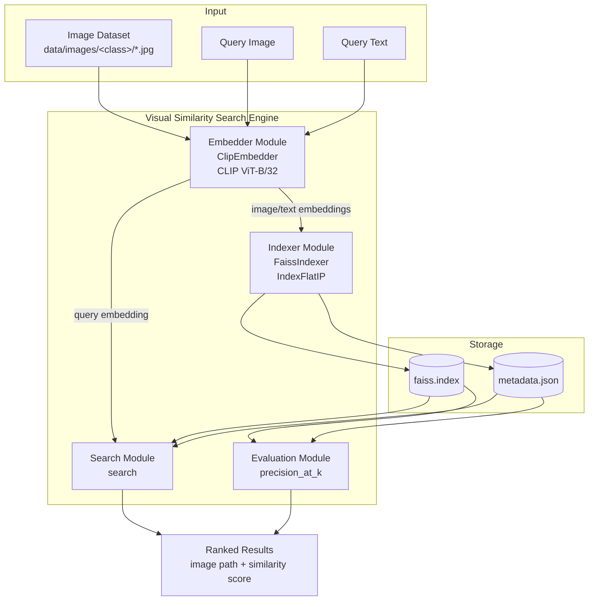
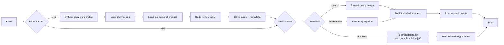
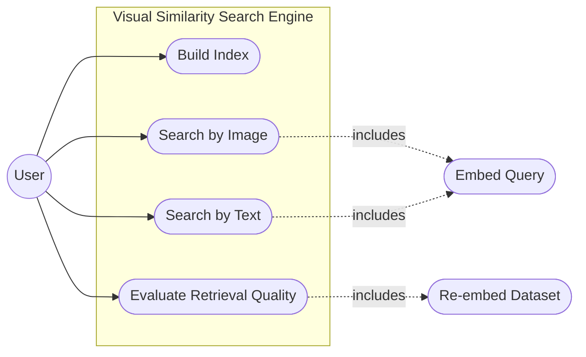
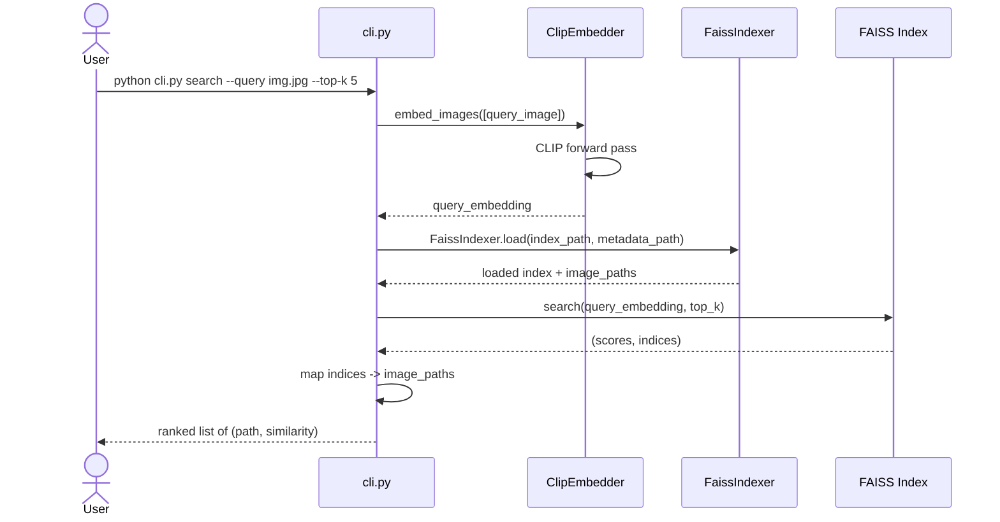
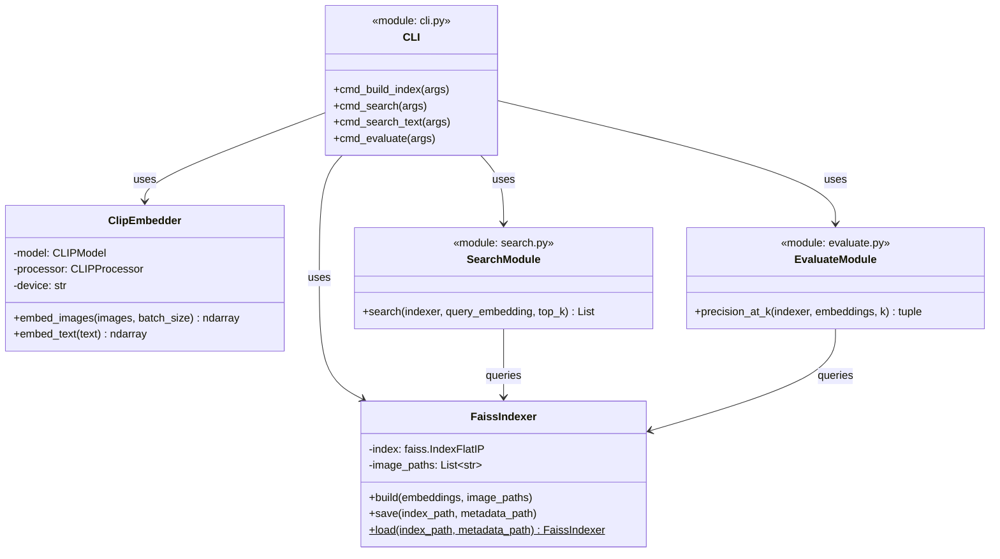
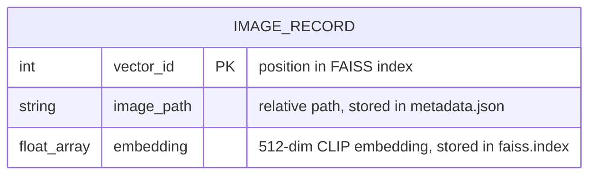

# Design Diagrams

These render automatically when viewing this file on GitHub. For the
PDF report, paste any of the code blocks below into https://mermaid.live
and export as PNG/SVG.

---

## 1. System Architecture



---

## 2. Workflow / Process Flow



---

## 3. Use Case Diagram



---

## 4. Sequence Diagram — Image Search



---

## 5. Class / Component Diagram



---

## 6. Data / Storage Schema

No relational database is used — persistence is a FAISS binary index
paired with a JSON metadata sidecar. Schema shown as an ER-style
diagram for documentation purposes:



**`index/faiss.index`** — binary FAISS `IndexFlatIP` file; row `i` holds the
L2-normalized 512-dim embedding for the `i`-th image.

**`index/metadata.json`**:
```json
{
  "image_paths": ["data/images/rose/10503217854_e66a804309.jpg", "..."]
}
```
`image_paths[i]` corresponds to embedding row `i` in `faiss.index` — this
positional mapping is the join key between the two files.
